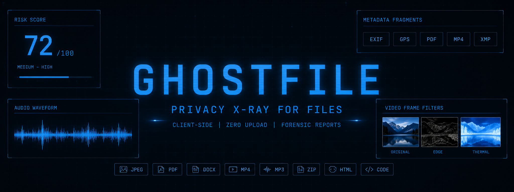

<p align="center">
  
</p>

<h1 align="center">GhostFile</h1>

<p align="center">
  <strong>Privacy X-Ray for files before they leave your device.</strong>
</p>

<p align="center">
  
  
  
</p>

<p align="center">
  <code>metadata</code> | <code>media forensics</code> | <code>audio signals</code> | <code>writing fingerprints</code> | <code>local reports</code>
</p>

---

## Why GhostFile Exists

Files talk.

A photo can carry GPS coordinates. A PDF can name the software that made it. A video can expose codec traces, timestamps, audio fingerprints, faces, reflections, and background details. A document can preserve authors, comments, templates, and revision history. Even plain text can reveal writing habits.

GhostFile turns those hidden signals into a readable privacy report, entirely in the browser.

No upload. No account. No backend. Just drop a file and see what it says about you.

## What It Finds

GhostFile looks across several layers of a file instead of stopping at basic metadata.

| Layer | Examples |
| --- | --- |
| Metadata | GPS, timestamps, device model, creator fields, editing software |
| Documents | PDF producer tags, Office authors, comments, templates, revision traces |
| Images | EXIF, camera hints, embedded thumbnails, compression artifacts |
| Video | MP4 brands, codecs, track handlers, encoder tags, creation time, visual risks |
| Audio | waveform, spectrogram, dominant frequencies, noise floor, speech-band energy |
| Writing | sentence length, vocabulary richness, spelling variant, punctuation habits |
| Code | emails, URLs, comments, naming style, indentation, TODO patterns |

## Highlights

- Runs as a static browser app
- Keeps files on the local device
- Builds a risk score from detected privacy threats
- Shows extracted evidence instead of vague warnings
- Includes visual review modes for images, GIFs, and videos
- Adds manual forensic filters for video inspection
- Renders audio waveform, oscilloscope, and frequency views
- Detects writing-style fingerprints in text-bearing files
- Exports a local report archive
- Includes browser-side metadata cleanup where possible

## Supported Formats

| Type | Formats |
| --- | --- |
| Images | `JPEG`, `PNG`, `WebP`, `GIF`, `BMP`, `TIFF`, `HEIC` |
| Documents | `PDF`, `DOCX`, `PPTX`, `XLSX`, `TXT` |
| Audio | `MP3`, `WAV`, `FLAC`, `AAC`, `OGG`, `M4A` |
| Video | `MP4`, `MOV`, `WebM`, `MKV`, `AVI` |
| Archives | `ZIP`, `TAR`, `RAR`, `7Z` |
| Code / Web | `HTML`, `SVG`, `JS`, `TS`, `PY`, `JAVA`, `GO`, `C/C++`, `CSS`, `JSON`, `YAML` |

## Screens And Reports

GhostFile produces a report-style interface with:

- threat severity cards
- raw metadata tables
- visual privacy review
- filtered media previews
- audio analysis panels
- writing fingerprint summaries
- local export options

The goal is not only to say "metadata exists." The goal is to explain what the file reveals and why it matters.

## Privacy Model

GhostFile is designed for local inspection.

The app uses browser APIs such as `FileReader`, `Canvas`, media elements, and `AudioContext`. Files are processed in the browser session and are not sent to a server by the app.

Some operating-system-level attributes cannot be read from browser JavaScript. When GhostFile cannot inspect a class of data directly, it reports that limitation instead of pretending to know more than it does.

## Run Locally

Open `ghostfile.html` in a modern browser.

If your browser blocks local file behavior, serve the folder locally:

```bash
python -m http.server 8000
```

Then visit:

```text
http://localhost:8000/ghostfile.html
```

## Project Structure

```text
GhostFile/
|-- ghostfile.html
`-- README.md
```

## Visual Identity

GhostFile uses a dark terminal-inspired interface with light blue accents.

The banner and logo should feel minimal, forensic, and technical:

- uppercase monospace wordmark
- light blue primary color
- near-black grid background
- subtle scan-line or file-outline symbol
- no glossy lock icon, shield mascot, or generic antivirus styling

## Roadmap

- Better MP4/MOV metadata coverage
- Batch scanning
- Report themes
- Before/after metadata diff views
- More video frame inspection modes
- Stronger document parser coverage

## Disclaimer

GhostFile is a privacy inspection and awareness tool. It can reveal many risks and remove some metadata, but it cannot guarantee complete anonymization.

Faces, voices, reflections, writing style, visible locations, and scene details can remain identifiable even after metadata is removed.
