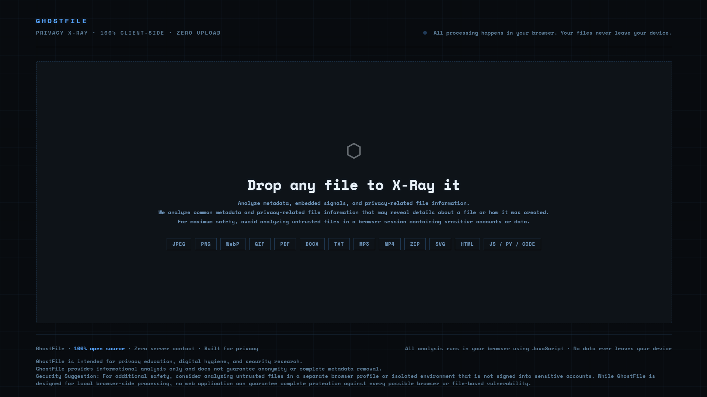
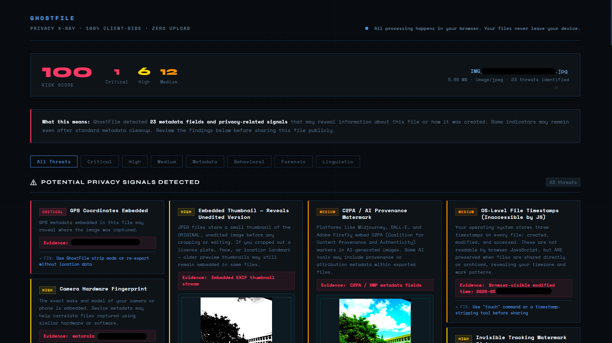
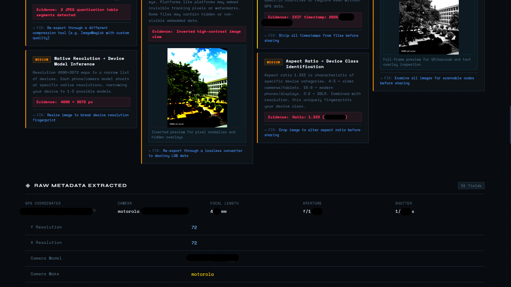
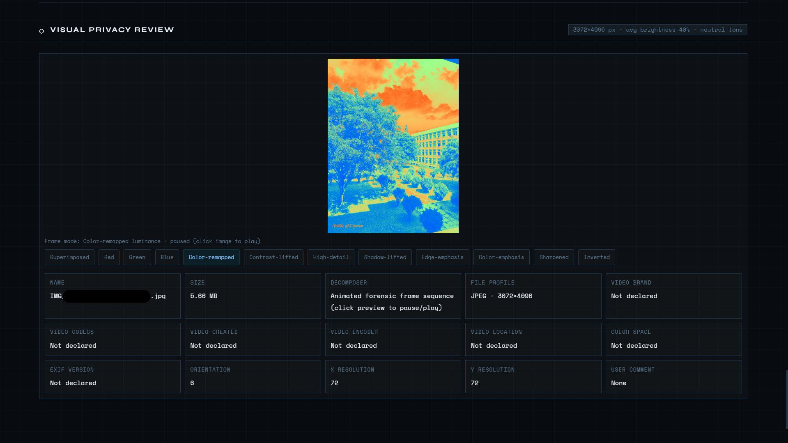
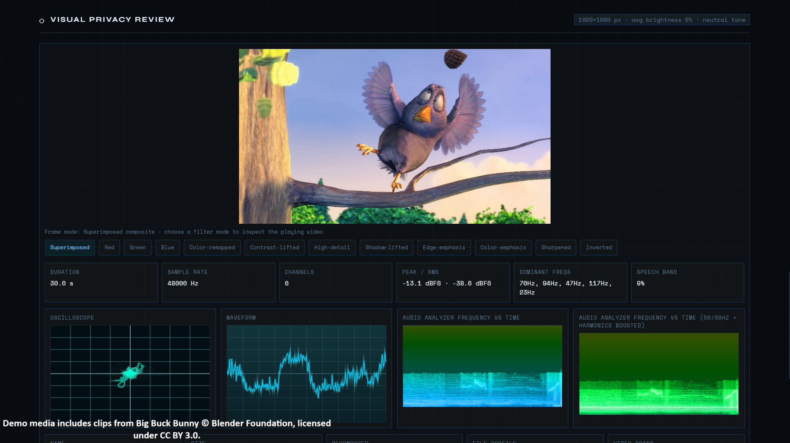
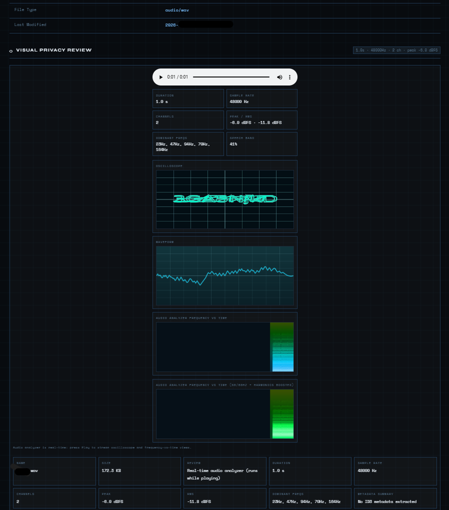
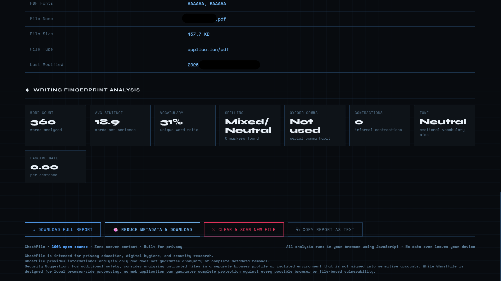
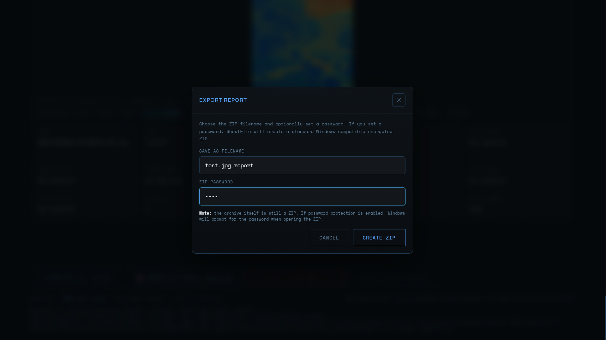

<p align="center">
  
</p>

<h1 align="center">GHOSTFILE</h1>

<p align="center">
  <strong>Privacy X-Ray for files before they leave your device.</strong>
</p>

<p align="center">
  
  
  
  
</p>

<p align="center">
  <code>metadata</code> •
  <code>media forensics</code> •
  <code>audio signals</code> •
  <code>writing fingerprints</code> •
  <code>browser-side analysis</code>
</p>

---

# What Is GhostFile?

GhostFile is a browser-based privacy and forensic inspection tool that reveals hidden metadata, embedded signals, and identifying traces inside files.

Photos, videos, PDFs, audio files, and even plain text can expose:
- GPS coordinates
- device information
- timestamps
- embedded thumbnails
- AI provenance markers
- writing fingerprints
- editing software traces
- codec signatures
- hidden overlays

GhostFile transforms those hidden signals into a readable privacy report — entirely inside your browser.

No uploads.  
No cloud processing.  
No account system.  
No server-side analysis.

---

# Why It Matters

Most people think removing visible information is enough.

It is not.

A single file may still expose:
- where it was created
- which phone or camera captured it
- when it was edited
- which software processed it
- hidden previews
- compression fingerprints
- stylistic writing habits
- audio patterns
- rendering pipeline traces

GhostFile helps users inspect those risks before sharing files publicly.

---

# Features

- 100% client-side analysis
- Zero-upload privacy model
- Privacy threat scoring
- Raw metadata extraction
- Embedded GPS detection
- Camera/device fingerprint analysis
- AI provenance / C2PA detection
- Visual forensic inspection filters
- Spectrogram & waveform rendering
- Writing fingerprint analysis
- Metadata cleanup tools
- Encrypted downloadable ZIP reports

---

# Screenshots

---

## Home Interface

<p align="center">
  
</p>

Minimal drag-and-drop interface designed for local browser-based privacy inspection.

---

## Privacy Threat Dashboard

<p align="center">
  
</p>

GhostFile generates a threat-oriented privacy report showing:
- severity levels
- embedded risks
- forensic indicators
- metadata exposure
- evidence-backed findings

---

## Raw Metadata Extraction

<p align="center">
  
</p>

Extracted metadata may include:
- GPS coordinates
- camera details
- focal length
- aperture
- shutter speed
- timestamps
- resolution fingerprints
- embedded software traces

---

## Forensic Color Remapping

<p align="center">
  
</p>

Advanced luminance remapping helps expose:
- hidden overlays
- compression artifacts
- watermark remnants
- embedded visual anomalies
- unnatural image structures

---

## Video Forensic Review

<p align="center">
  
</p>

Frame-level visual inspection with:
- edge emphasis
- contrast lifting
- color isolation
- sharpened forensic modes
- overlay inspection
- visual anomaly highlighting

---

## Audio Privacy Analysis

<p align="center">
  
</p>

Browser-side audio analysis includes:
- waveform visualization
- oscilloscope rendering
- RMS/peak analysis
- frequency distribution
- spectrogram inspection
- dominant frequency mapping

---

## Writing Fingerprint Analysis

<p align="center">
  
</p>

Text-bearing files can reveal:
- sentence structure
- punctuation habits
- vocabulary distribution
- tone consistency
- passive voice usage
- stylistic fingerprints

---

## Encrypted Report Export

<p align="center">
  
</p>

GhostFile can export privacy inspection reports locally as downloadable ZIP archives.

Features include:
- custom report naming
- optional ZIP password protection
- browser-side archive generation
- local-only export workflow
- Windows-compatible encrypted ZIP support

No reports are uploaded or stored remotely.

---

# Supported File Types

| Category | Formats |
|---|---|
| Images | JPEG, PNG, WebP, GIF, BMP, TIFF |
| Documents | PDF, DOCX, TXT |
| Audio | MP3, WAV, FLAC, AAC |
| Video | MP4, MOV, WebM |
| Archives | ZIP |
| Code/Web | HTML, JS, CSS, JSON, SVG |

---

# Privacy Model

GhostFile is designed around strict local processing.

All analysis happens directly in the browser using:
- FileReader APIs
- Canvas APIs
- AudioContext APIs
- browser media decoders

Files are never uploaded by the application itself.

---

# Metadata Cleanup

GhostFile includes browser-side metadata reduction tools for supported formats.

Supported cleanup actions may include:
- EXIF removal
- GPS stripping
- timestamp reduction
- software tag cleanup
- embedded metadata minimization

All cleanup runs locally whenever supported.

---

# Tech Stack

- HTML5
- CSS3
- Vanilla JavaScript
- Canvas API
- Web Audio API
- Browser Media APIs

---

# Running Locally

Clone the repository:

```bash
git clone https://github.com/yourusername/ghostfile.git
```

Open the project:

```bash
cd ghostfile
```

Run a local server:

```bash
python -m http.server 8000
```

Visit:

```text
http://localhost:8000
```

---

# Project Structure

```text
GHOSTFILE/
│
├── assets/
├── screenshots/
├── index.html
├── README.md
└── LICENSE.md
```

---

# Responsible Use

GhostFile is intended for:
- privacy awareness
- digital hygiene
- educational security research
- legitimate forensic inspection

This project is not intended for:
- unlawful concealment
- evidence tampering
- impersonation
- harassment
- malicious activity

Removing metadata does not guarantee anonymity.

Visible scene details, faces, voices, reflections, and writing style may still reveal identity.

---

# Roadmap

- Batch analysis
- Advanced document parsing
- Archive deep inspection
- OCR & hidden text analysis
- Steganography indicators
- Better MP4/MOV metadata coverage
- Before/after metadata comparison

---

# License

Licensed under the MIT License.

---

<p align="center">
  Built for privacy, transparency, and digital awareness.
</p>